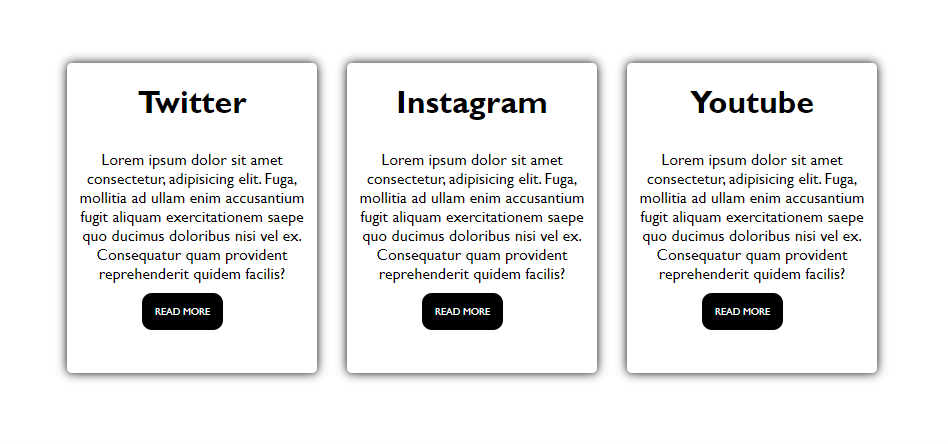
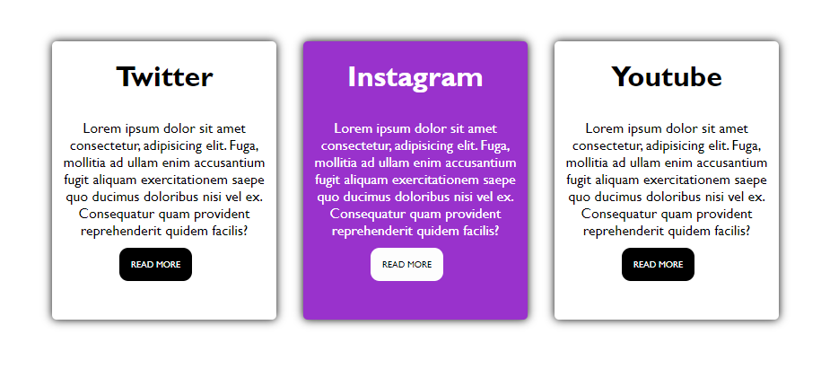

### Card Hover

Users should be able to:

- View the optimal layout for the app depending on their device's screen size
- See hover states for all interactive elements on the page
- View the 3 Card (Twitter,Instagram & Youtube)

### Screenshot

## My process

### Built with

- Semantic HTML markup
- CSS custom properties

## Author

Developer Faizal
